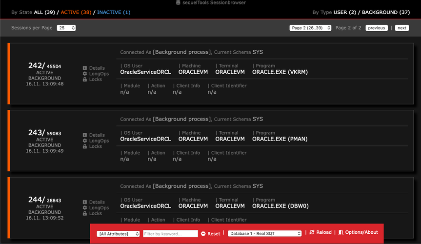
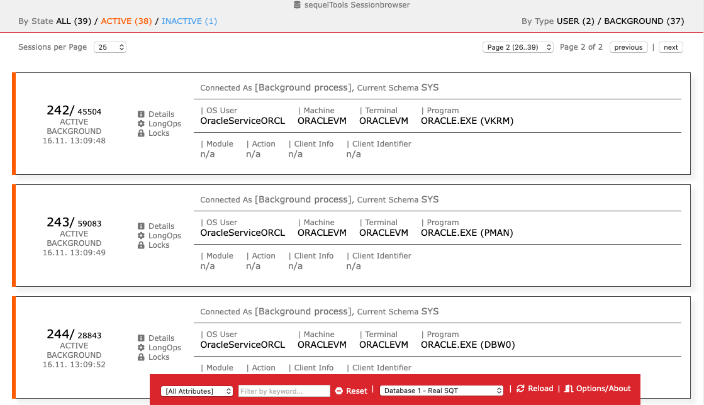
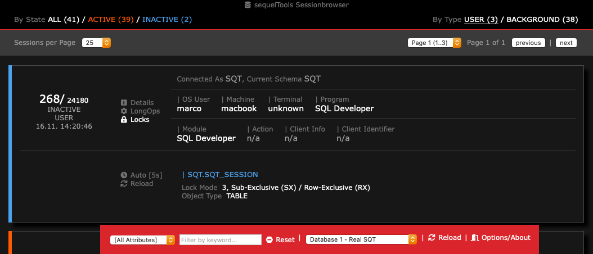
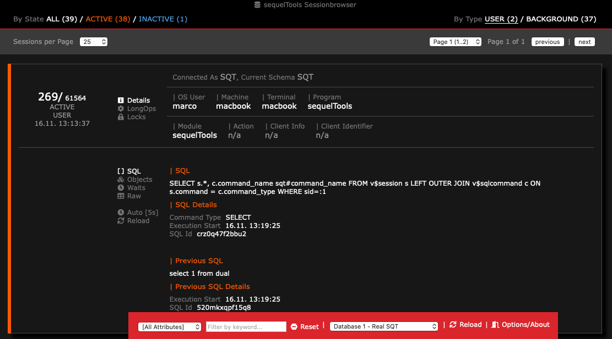

# sequelTools Sessionbrowser

## Overview
sequelTools Sessionbrowser is a browser-based application for Oracle database 
developers who want to get better insights into what is happening in their databases.

### Download
Downlod current version from the [Releases](https://github.com/codetist/sequeltools/releases/).

### Features
* Easy to use browser-based user interface.
* Built on JVM, available for all major operating systems.
* Access multiple database instances and switch between them easily.
* Dark or light appearance. Switchable anytime.
* Find and filter your sessions by state, type or keyword instantly.
* Identify blocking and blocked sessions.
* Inspect session details: state, locks, wait events, long ops, current SQL...
* Easy auto reload for session details with configurable timers.
* Free of charge, for personal and commercial use.

### Screenshots









## Requirements

### JRE/JDK
* sequelTools is built on JDK8, so this is the minimum required JVM 
  version.

### Oracle Database
* Oracle database version 11 and higher.
* Database user that is allowed to access data dictionary and Oracle dynamic 
  performance (v$) views.
* some features like session history require separately licensed Oracle Options 
  or Management Packs.

### Oracle JDBC driver
Download appropriate drivers from 
https://www.oracle.com/database/technologies/appdev/jdbc-downloads.html.

### Browser
sequelTools requires a browser supporting ECMAScript 6 (a.k.a ES6 or 
Javascript 6). Minimum required browser versions are:
* Chrome 58
* Edge 14
* Firefox 54
* Safari 10 
* Opera 55

## Running sequelTools

### Configuration
In order to run sequelTools configuration file needs to be stored in the 
classpath using config.json as filename.
```
{
  "database": {
    "connections": [
      {
        "dataSourceName": "db1",
        "description": "Database 1 SQT",
        "url": "jdbc:oracle:thin:sqt/oracle@oraclevm.lan:1521/orclpdb",
        "driver": "oracle.jdbc.OracleDriver",
        "useSessionCache": false,
        "initialPoolSize": 3,
        "minPoolSize": 1,
        "maxPoolSize": 10,
        "refreshInterval": 5,
        "acquireRetryAttempts": 1,
        "checkConnectionOnStartup": true
      },
      {
        "dataSourceName": "db2",
        "description": "Database 2 SQT",
        "url": "jdbc:oracle:thin:sqt/oracle@oraclevm.lan:1521/orclpdb",
        "driver": "oracle.jdbc.OracleDriver",
        "useSessionCache": false,
        "initialPoolSize": 3,
        "minPoolSize": 1,
        "maxPoolSize": 10,
        "refreshInterval": 5,
        "acquireRetryAttempts": 1,
        "checkConnectionOnStartup": true
      }
    ]
  },
  "httpServer": {
    "port": 8080,
    "bindToHost": "127.0.0.1",
    "baseUrl": "http://localhost:8080/"
  },
  "application": {
  }
}
```

### JAR distribution
Download JDBC drivers from Oracle homepage and put the JAR file in the 
same directory where sequeltools*.jar is already located. Then run

```
java -cp '*' de.codemonaut.sequeltools.LauncherVerticle
```

### ZIP distribution
* Download and extract the sequelTools distribution file.
* Download JDBC drivers from the [JDBC Downloads](https://www.oracle.com/database/technologies/appdev/jdbc-downloads.html) page.
* Place the JDBC drivers jar file in the lib-subfolder of the extracted sequelTools Session Browser archive.
* Copy or rename the provided sample.config.json to config.json.
* Edit the config.json to provide your database connection information.
* Start application from the bin-directory by running sequeltools (Linux/Unix/MacOS) or sequeltools.bat (Windows).
* Point your browser to the url as shown on the console output, default is localhost:8080.
* You're ready to go!

## FAQ

### Why is displaying sessions so slow?
Depending on your database activity and usage the number of sessions 
to display might get very high. On slow machines rendering a high number 
of sessions in sequelTools might take a noticeable amount of time.
In this case reduce the number of sessions displayed per page. Default is 50.

### Is RAC supported?
RAC is currently not supported. However, you can create separate connections 
for each node. sequelTools will only show sessions of current node connected.

### Are there any advanced configuration options?

Yes. Here is the full list of configuration options for each section of the 
config.json file:

#### Section: `connection`

##### `dataSourceName` (required, no default)
Unique name for each database connection. Used for the Web API and to 
technically identify database connections in the application.

##### `description` (optional, default: dataSourceName)
A descriptive text for each database connection. This text is shown in the 
user interface, for example when selecting the database connection to be used. 
If it is not set, the value of dataSourceName will be used.

##### `url` (required, no default)

JDBC connection string. Examples, when connecting with:
* SID: `jdbc:oracle:thin:@<host>[:<port>]:<SID>`
* Service: `jdbc:oracle:thin:@//<host>[:<port>]/<service>`
* TNSNames: `jdbc:oracle:thin:@<TNSName>`

##### `user` (optional, required when not set in url)
User name, if you specify user and password in the JDBC url remove this option.

##### `password` (optional, required when not set in url)
Password, if you specify user and password in the JDBC url remove this option.

##### `driver` (optional, default: "oracle.jdbc.OracleDriver")
JDBC driver class.

##### `initialPoolSize` (optional, default: 1)
The number of physical database connections opened on application startup.

##### `minPoolSize` (optional, default: 1)
The minimum number of physical database connections that should stay 
established anytime.

##### `maxPoolSize` (optional, default: 2)
The maximum number of physical database connections that the application is 
allowed to establish. The default is suitable for using the application as a 
single user. Increase this value if you are hosting it as a server for a 
larger number of users.

##### `checkConnectionOnStartup` (optional, default: true)
If set to true the application will fail to launch when database connections 
cannot be established during startup. If set to false the application will 
launch successfully even if the corresponding connection cannot be created.

##### `acquireRetryAttempts` (optional, default: 3)
Defines how many retries are allowed when the application tries to establish 
a database connection.

##### `checkoutTimeout` (optional, default: 10000)
Timeout in milliseconds. If a database connection cannot be acquired within 
the given time, the connection will fail.

#### Section: `httpServer`

##### `bindToHost` (optional, default: "127.0.0.1")
IP address or host name the HTTP server binds to. With the default value of 
"127.0.0.1" the application accepts local connections only. To allow 
connections from remote hosts place your public IP here. To accept connections 
on all available interfaces use "0.0.0.0".

##### `port` (optional, default: 8080)
Local port used for serving the web interface.

##### `baseUrl` (optional, default: "/")
Set this option when running sequelTools Session Browser behind a Reverse 
Proxy. For example: The application should be available on 
https://myserver/sequeltools then set baseUrl to "https://myserver/sequeltools/".
Make sure to put the url here exactly the same way as it is accessed later. 
Otherwise browser security may kick in and prevent the web application from 
working. This is especially important for 127.0.0.1 versus localhost.

### Is it possible to work with debug tables for testing?
For testing purposes it might be desirable using deviant tables for querying 
sessions data from the Oracle database. This can be achieved by adding a 
debug-block to the connection configuration. If debug is disabled or not present at
all, default Oracle tables are used.

```
    "debug" : {
      "enabled": true,
      "sessionsTable" : "sqt_session",
      "sqlTable" : "sqt_sql",
      "proceduresTable" : "sqt_procedures",
      "sqlCommandsTable" : "v$sqlcommand",
      "objectsTable" : "sqt_objects",
      "sessionLongOpsTable" : "v$session_longops"
    }
```
### Is more detailed logging available?
Logs can be enabled in configuration file using the "application" section. Valid levels are:
off, all, finest, finer, fine, config, info, warning and severe. 

```
    "application": {
        "logLevel": "off"
    }
```

### Is user authentication and/or TLS support planned?

No. For such use cases it is recommended to run sequelTools Session Browser 
behind a Reverse Proxy. See [How to setup the application behind a Reverse 
Proxy?](#reverseproxy) for details.

### <a name="reverseproxy"></a>How to setup the application behind a Reverse Proxy?

On root directory just set up your Reverse Proxy and you are ready to go. An 
example NGINX configuration could look as follows:

```
server {
    listen 80;
    server_name sqt.myserver.local;

    location / {
        proxy_pass http://localhost:8080;
    }
}
```

In case you need a sub-path, change the httpServer-section of your config.json and 
add the option baseUrl. For the following NGINX configuration set 
"baseUrl": "http://sqt.myserver.local/sequeltools/":

```
server {
    listen 80;
    server_name sqt.myserver.local;

    location /sequeltools {
        proxy_pass http://localhost:8080;
    }
}
```

## Project status

* Development inactive. 
* Current version is still usable. In 2022 I am still using it quite often 
  when working with Oracle Databases. :)

## Disclaimer

* This project startet (and until now also ended) as a [Vert.x](https://vertx.io) learning project in 2019.
* All trademarks mentioned on this site are the property of their respective owners. 
